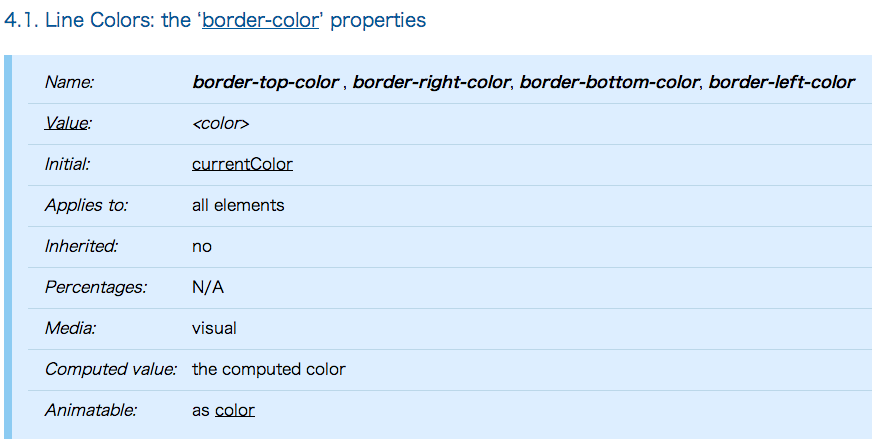

## ご存じですか、colorプロパティ

[@GeckoTang](http://twitter.com/GeckoTang)

---

## GeckoTang


- げこたん [Twitter](http://twitter.com/GeckoTang)  [GitHub](https://github.com/geckotang)
- [株式会社ピクセルグリッド](http://www.pxgrid.com/)
- フロントエンド・エンジニア
- 自称CSSプログラマ
- [CSS Panic](https://developer.mozilla.org/ja/demos/detail/css-panic)
- [惚れさせ男子 for Alfred 2](https://github.com/geckotang/alfred-horesase-workflow)
- [突然のAlfred for Alfred 2](https://github.com/geckotang/alfred-suddendeath-workflow)

---

## colorプロパティとは

---

## 「文字の色」を変えるプロパティ

---

## だと思っていませんか？

---

# 違います

---

## 以下の結果を想像してください。

```html
<div class="block">The quick brown fox jumps over the lazy dog.</div>
```

```css
.block {
  color: tomato;
}
```

[DEMO](http://codepen.io/geckotang/pen/hAwcC)

---

## では、この場合は？


```html
<div class="block">The quick brown fox jumps over the lazy dog.</div>
```

```css
.block {
  color: tomato;
  border: 1px solid;
}
```

色指定を省略したborderプロパティを指定しました。

---

## 想像通りの結果になった？

[DEMO](http://codepen.io/geckotang/pen/wDltj)

---

## colorプロパティの値は、他のプロパティに影響をあたえることがあります

---

### 初期値がcolorプロパティの値のプロパティ

- border-color
- outline-color
- text-shadow
- box-shadow
- text-decoration
- text-decoration-color ※1
- text-emphasis-color ※1
- column-rule-color ※1

<hr>

※1 多くのブラウザは未実装

---

### border-colorの仕様をみてみる

http://www.w3.org/TR/css3-background/#the-border-color



---

Initial: currentColor

<div style="font-size: 300%">
＿人人人人人人人人＿  
＞　currentColor　＜  
￣Y^Y^Y^Y^Y^Y^Y^￣  
</div>

[http://www.w3.org/wiki/CSS3/Color/currentColor](http://www.w3.org/wiki/CSS3/Color/currentColor)

---

## currentColorとは

カラーコード(#000, black, rgba...)などと同様に使えるキーワードです。

**currentColor** は、その要素のcolorプロパティの値となります。

CSSに珍しくキャメルケースなのは、SVG由来だかららしい。

------

### border-colorの初期値はcurrentColor

```css
.block {
  color: tomato;
  border: 1px solid;
}
```

は、暗黙的にこうなっている。

```css
.block {
  color: tomato;
  border: 1px solid currentColor;
}
```

この要素のcolorプロパティの値はtomatoなので<br>
currentColorは、tomatoとして扱われます。

------

### colorを祖先から継承している場合

```html
<div class="block1">
	<div class="block2">
		The quick brown fox jumps over the lazy dog.
	</div>
</div>
```

```css
.block1 {
  color: tomato;
}
.block2 {
  border: 1px solid;
}
```

[DEMO](http://codepen.io/geckotang/pen/wDltj)

------

### これは暗黙的にこのようになっています。

```css
.block1 {
  color: tomato;
}
.block2 {
  color: inherit; /*tomato*/
  border: 1px solid currentColor; /*tomato*/
}
```

colorプロパティは、初期値がinherit（継承）なので、<br>
親要素のcolorプロパティの値を継承します。<br>
currentColorはその要素のcolorプロパティの値なので、tomato。

---

## currentColorの使いドコロ

------

### フラットなボタン。

currentColor使わない...

```html
<a class="button" href="#">Button 0</a>
<a class="button  button--type-1" href="#">Button 1</a>
<a class="button  button--type-2" href="#">Button 2</a>
```

```css
.button {
  display: inline-block;
  padding: 10px 30px;
  color: #111;
  border: 3px solid #111;
  border-radius: 6px;
  text-decoration: none;
  transition: 0.2s all linear;
}
.button--type-1 { color: darksalmon; border-color: darksalmon; }
.button--type-1:hover { color: tomato; border-color: tomato; }
.button--type-2 { color: limegreen; border-color: limegreen; }
.button--type-2:hover { color: lime; border-color: lime;}
```

[DEMO](http://codepen.io/geckotang/pen/GLKyl)

------

### フラットなボタン。

currentColor使うと...

```html
<a class="button" href="#">Button 0</a>
<a class="button  button--type-1" href="#">Button 1</a>
<a class="button  button--type-2" href="#">Button 2</a>
```

```css
.button {
  display: inline-block;
  padding: 10px 30px;
  color: #111;
  border: 3px solid currentColor;
  border-radius: 6px;
  text-decoration: none;
  transition: 0.2s all linear;
}
.button--type-1 { color: darksalmon; }
.button--type-1:hover { color: tomato; }
.button--type-2 { color: limegreen; }
.button--type-2:hover { color: lime; }
```

[DEMO](http://codepen.io/geckotang/full/cignj/)
---

## より詳しくは[CodeGrid](http://www.codegrid.net/)で！


[CSS再入門 colorプロパティ](https://app.codegrid.net/entry/css-color)

---

## ご清聴ありがとうございました。
